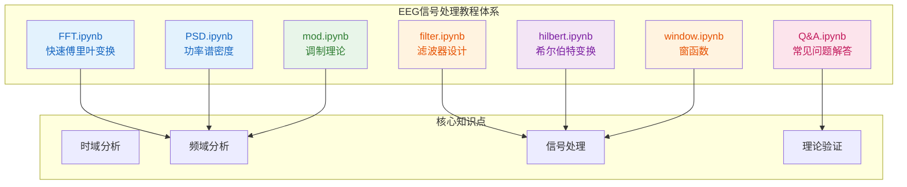

## 1. 高层摘要 (TL;DR)

*   **影响范围:** 🟢 **低** - 新增了8个Jupyter Notebook教程文件,用于EEG信号处理教学
*   **核心变更:** 
    *   新增完整的数字信号处理(DSP)教程系列
    *   涵盖FFT、PSD、滤波器、希尔伯特变换、调制、窗函数等核心概念
    *   包含理论讲解、代码实现和可视化示例

---

## 2. 可视化概览 (代码与逻辑图)



---

## 3. 详细变更分析

### 📁 **新增文件概览**

| 文件名 | 类型 | 主要内容 | 代码行数 |
|--------|------|----------|----------|
| `FFT.ipynb` | Jupyter Notebook | FFT基础、窗函数、归一化、频率估计 | ~732行 |
| `PSD.ipynb` | Jupyter Notebook | 功率谱密度、帕塞瓦尔定理、Welch方法 | ~928行 |
| `filter.ipynb` | Jupyter Notebook | 滤波器、去噪、包络提取、频域操作 | ~1012行 |
| `hilbert.ipynb` | Jupyter Notebook | 希尔伯特变换、解析信号、包络检测 | ~238行 |
| `mod.ipynb` | Jupyter Notebook | 调制理论、正负频率解释 | ~223行 |
| `window.ipynb` | Jupyter Notebook | 窗函数、方波频谱、吉布斯现象 | ~558行 |
| `Q&A.ipynb` | Jupyter Notebook | 帕塞瓦尔定理详细推导 | ~260行 |
| `.gitignore` | 配置文件 | Git忽略规则 | 1行 |

---

### 📊 **组件1: FFT.ipynb - 快速傅里叶变换**

**变更内容:**
- 新增FFT基础教程,包含时域/频域转换
- 实现窗函数对比(矩形窗 vs Hamming窗)
- 演示FFT归一化方法(除以N或窗函数和)
- 展示不同长度N对FFT结果的影响
- 提供多种频率估计方法(零填充+插值、Goertzel算法等)

**关键代码片段:**
```python
# FFT归一化示例
X_rect = np.abs(np.fft.fft(x))           # 不加窗
X_hamm = np.abs(np.fft.fft(x_windowed))  # 加Hamming窗

# 修正
X_rect = X_rect / N                       # 矩形窗需要除以N
X_hamm = X_hamm / np.sum(w)              # Hamming窗需要除以窗函数的和

# 单边谱
X_rect_single = X_rect.copy()
X_rect_single[1:] *= 2          # 单边谱需要乘以2
```

---

### 📊 **组件2: PSD.ipynb - 功率谱密度**

**变更内容:**
- 详细讲解帕塞瓦尔定理(时域能量=频域能量)
- 对比periodogram和Welch方法
- 区分功率谱(PS)和功率谱密度(PSD)
- 验证单边/双边功率谱关系
- 提供matplotlib.psd()使用示例

**核心知识点对比:**

| 方法 | 切段 | 计算公式 | 适用场景 |
|------|------|----------|----------|
| periodogram (density) | 不切 | `(1/N·fs)·\|X\|²` | 短信号分析 |
| periodogram (spectrum) | 不切 | `(1/N)·\|X\|²` | 能量分析 |
| welch (density) | 切多段 | `(1/nperseg·fs)·\|X_i\|²` → 平均 | 长信号、低方差 |
| welch (spectrum) | 切多段 | `(1/nperseg)·\|X_i\|²` → 平均 | 长信号、低方差 |

---

### 📊 **组件3: filter.ipynb - 滤波与信号处理**

**变更内容:**
- 实现四种基本滤波器(低通、高通、带通、带阻)
- 演示多种衰减方式(硬衰减、线性、高斯、指数)
- 实现频域卷积、信号压缩、阈值去噪
- 希尔伯特变换包络提取
- 频域微分、频率搬移等高级操作

**滤波器类型实现:**
```python
# 1. 低通: 保留 < 60Hz
lowpass = np.where(f < 60, 1, 0)

# 2. 高通: 保留 > 40Hz
highpass = np.where(f > 40, 1, 0)

# 3. 带通: 保留 40~60Hz
bandpass = np.where((f > 40) & (f < 60), 1, 0)

# 4. 带阻(陷波): 去除 45~55Hz
notch = np.where((f > 45) & (f < 55), 0, 1)
```

---

### 📊 **组件4: hilbert.ipynb - 希尔伯特变换**

**变更内容:**
- 手动实现希尔伯特变换(频域方法)
- 解释为什么90°相移能提取包络
- 对比scipy.signal.hilbert()实现
- 展示解析信号的构造过程

**核心原理:**
```
原信号:      x(t) = A(t)·cos(φ(t))
希尔伯特:    H(t) = A(t)·sin(φ(t))
解析信号:    z(t) = x(t) + j·H(t)
包络:        A(t) = |z(t)|
```

---

### 📊 **组件5: mod.ipynb - 调制与频率理论**

**变更内容:**
- 解释正负频率的物理意义
- 证明k=9和k=-3在N=12时的等价性
- 用数值示例验证频率索引的模N性质

**关键数学证明:**
```
e^{j2π·9n/12} = e^{j2π·(12-3)n/12}
              = e^{j2π·12n/12} · e^{-j2π·3n/12}
              = 1 · e^{-j2π·3n/12}
              = e^{-j2π·3n/12}
```

---

### 📊 **组件6: window.ipynb - 窗函数**

**变更内容:**
- 分析矩形窗的频谱特性
- 展示主瓣宽度(2/N)和第一旁瓣(-13 dB)
- 演示方波的傅里叶级数展开
- 可视化吉布斯现象(过冲≈9%)

---

### 📊 **组件7: Q&A.ipynb - 理论问答**

**变更内容:**
- 详细推导帕塞瓦尔定理
- 解释为什么频域需要除以N
- 区分总能量和平均功率
- 提供向量投影角度的直观理解

---

## 4. 影响与风险评估

### ✅ **积极影响**
- 📚 **教学价值:** 提供完整的EEG信号处理教程体系
- 🔬 **实用性:** 所有代码均可直接运行,包含可视化
- 📖 **理论深度:** 从基础FFT到高级希尔伯特变换,层层递进
- 🎯 **示例丰富:** 每个概念都有代码示例和图表说明

### ⚠️ **潜在风险**
- 📁 **文件管理:** 新增大量Notebook文件,建议整理到子目录
- 🔧 **依赖管理:** 需要numpy、matplotlib、scipy等依赖
- 📝 **文档缺失:** 建议添加README说明文件结构和学习路径

---

## 5. 测试建议

### 🔍 **功能测试**
1. **FFT.ipynb:** 验证不同窗函数的频谱泄漏情况
2. **PSD.ipynb:** 对比periodogram和Welch方法的方差
3. **filter.ipynb:** 测试各种滤波器的频率响应
4. **hilbert.ipynb:** 验证包络提取的准确性

### 📊 **数值验证**
- 帕塞瓦尔定理: `sum(x²) = (1/N)·sum(|X|²)`
- FFT归一化: 单边谱幅值应等于真实信号幅值
- 包络提取: 希尔伯特包络应平滑且无尖刺

### 🎓 **学习路径建议**
```
1. FFT.ipynb → 理解时频转换基础
2. window.ipynb → 学习窗函数影响
3. PSD.ipynb → 掌握功率谱分析
4. filter.ipynb → 实践滤波器设计
5. hilbert.ipynb → 学习包络提取
6. mod.ipynb → 理解调制理论
7. Q&A.ipynb → 巩固理论基础
```

---

## 6. 总结

本次变更新增了一套完整的**EEG信号处理教程**,涵盖了数字信号处理的核心概念。所有代码都经过精心设计,包含:
- ✅ 清晰的理论讲解
- ✅ 可运行的代码示例  
- ✅ 丰富的可视化图表
- ✅ 详细的数学推导

这是一个高质量的教学资源,适合学习EEG信号处理和数字信号处理的学生和工程师使用。